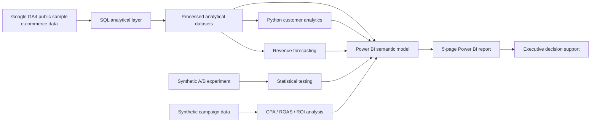
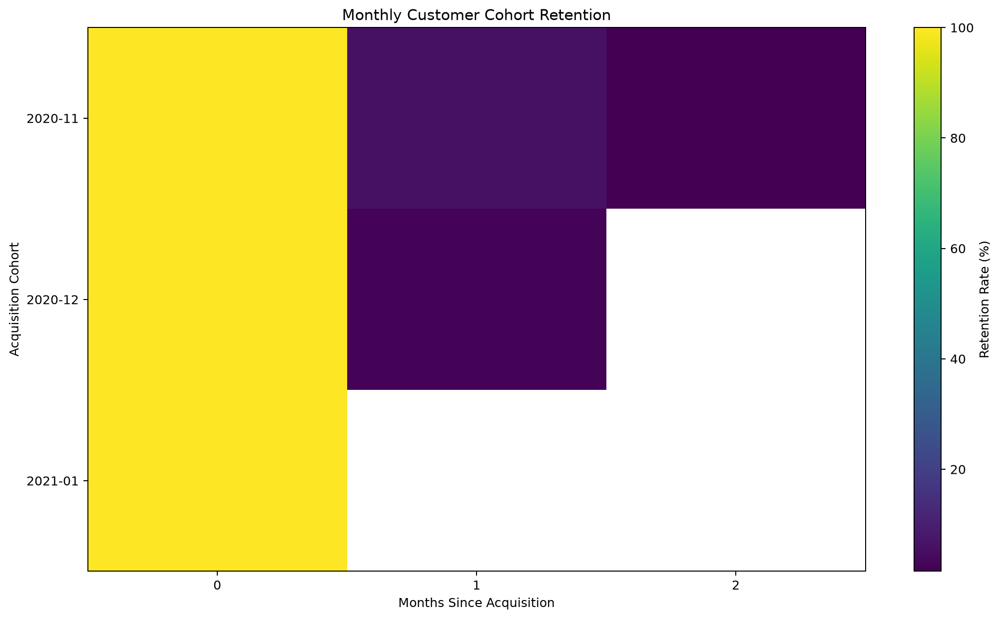
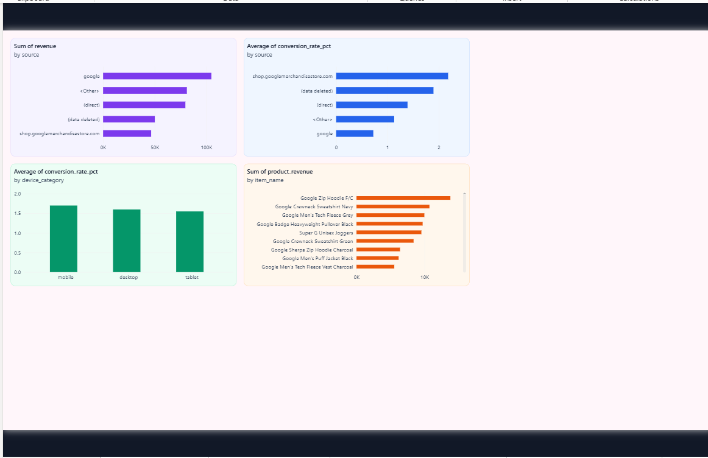
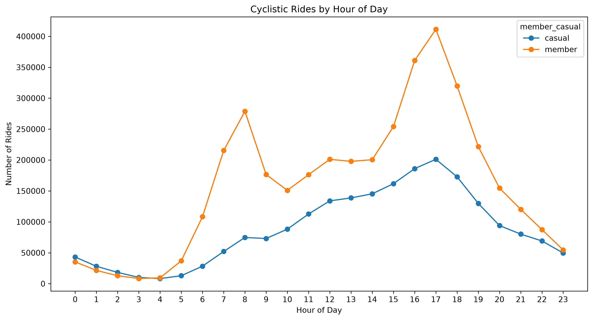
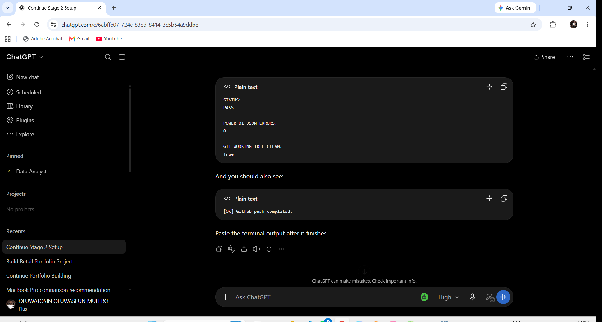

# Customer 360 & Revenue Growth Analytics

[](https://github.com/tosinmulero/customer-360-revenue-growth-analytics/actions/workflows/portfolio-quality.yml)


**A source-controlled Customer 360 and revenue-growth analytics solution combining SQL, Python, statistical modelling and Microsoft Power BI.**

The project moves from customer-level behavioural data to executive decision support across acquisition, conversion, retention, product performance, revenue forecasting, experimentation and marketing efficiency.

> **Data integrity note:** Customer, acquisition, product, revenue and forecasting analysis use Google GA4 public sample e-commerce data. The A/B experiment observations and campaign-spend layer are synthetic, reproducible, and explicitly labelled throughout the project.

---

## Executive Snapshot

| Business outcome | Result |
| --- | ---: |
| Customers analysed | **270,154** |
| Purchasing customers | **4,419** |
| Repeat purchasing customers | **775** |
| Total GA4 revenue | **362,165** |
| Average revenue per customer | **1.34** |
| Highest-revenue month | **Dec 2020 - 160,555** |
| Highest-revenue acquisition channel | **google / organic - 95,775** |
| Top product | **Google Zip Hoodie F/C - 13,692** |
| Forecast holdout MAE | **1,809.72** |
| Forecast holdout RMSE | **2,278.03** |
| Synthetic A/B relative lift | **19.25%** |
| Synthetic A/B p-value | **0.0186** |

### What this project demonstrates

- End-to-end analytical problem solving from raw analytical extracts to executive dashboards.
- SQL transformation across customer, funnel, acquisition, cohort, RFM, product, device and revenue domains.
- Python-based validation, analytical preparation, visualisation and time-series modelling.
- Statistical experimentation using a reproducible two-proportion test.
- Commercial marketing analysis using CPA, ROAS, ROI and campaign economics.
- Source-controlled Power BI engineering using **PBIP, PBIR and TMDL**, rather than only an opaque PBIX artifact.
- Clear separation of observed data from synthetic demonstration data.
- Git-based reproducibility, documentation and automated repository quality checks.

---

## Business Problem

A commercial team needs a coherent view of customers, conversion, retention, products and revenue rather than disconnected reports.

This solution answers seven decision questions:

1. **Customer base:** How many customers purchase and how many purchase again?
2. **Acquisition:** Which source/medium combinations generate revenue and conversion?
3. **Retention:** Which cohorts retain customers most effectively?
4. **Segmentation:** Which customers are highest-value based on recency, frequency and monetary behaviour?
5. **Product:** Which products contribute most strongly to revenue?
6. **Forecasting:** What does recent revenue history imply for the next 14 days?
7. **Experimentation and marketing:** How can conversion tests and campaign economics be evaluated rigorously?

---

## Analytical Architecture



The architecture deliberately separates **observed GA4 analysis** from **synthetic experimentation and marketing scenarios**.

Full technical architecture: [`docs/TECHNICAL_ARCHITECTURE.md`](docs/TECHNICAL_ARCHITECTURE.md)

---

## Dashboard Gallery

### 1. Executive Overview


Executive KPIs covering customers, purchasing customers, revenue, purchase rate, repeat purchase rate and revenue per customer.

### 2. Customer & Retention



Customer segmentation, cohort behaviour and retention-oriented views.

### 3. Acquisition & Product Performance



Acquisition source performance, device conversion and product revenue.

### 4. Forecasting & Experimentation



Real-data revenue forecasting plus explicitly synthetic A/B and campaign-analysis demonstrations.

### 5. Marketing Performance



Campaign economics across spend, attributed revenue, CPA, ROAS and acquisition volume using synthetic campaign observations.

---

## SQL Analytics Layer

The repository contains **19 SQL analytical transformations**.

| Analytical area | SQL assets |
| --- | --- |
| Data profiling | Dataset profile, event types, daily activity |
| Acquisition | Traffic acquisition, channel performance |
| Customer 360 | Customer-level consolidated analytical view |
| Conversion | E-commerce funnel and conversion analysis |
| Retention | Cohort-retention analysis |
| Segmentation | RFM segmentation |
| Product | Product-performance analysis |
| Revenue | Revenue summary, monthly revenue, daily revenue |
| Device | Device analysis and device conversion |
| Business KPIs | Monthly commercial KPI layer |

Core SQL assets are available in [`sql/`](sql/).

---

## Customer 360 & Segmentation

The validated Customer 360 analytical output contains:

- **270,154 customer records**
- **0 duplicate user IDs**
- **0 missing user IDs**
- **4,419 purchasing customers**
- **775 repeat purchasing customers**

RFM methodology provides a structured view of:

- **Recency** - how recently a customer purchased
- **Frequency** - how often a customer purchased
- **Monetary value** - how much revenue a customer generated

This creates a reusable segmentation layer for retention, CRM and commercial targeting analysis.

---

## Acquisition & Product Performance

Key observed findings from the GA4 sample:

- **google / organic** is the highest-revenue acquisition channel in the analytical output at **95,775**.
- **Google Zip Hoodie F/C** is the highest-revenue product at **13,692**.
- Acquisition analysis combines revenue and conversion rather than relying on traffic volume alone.
- Device-level conversion analysis supports identification of experience or funnel differences by device category.

---

## Revenue Forecasting

The forecasting workflow uses **Holt's damped-trend method** on real GA4 daily revenue.

| Forecast design | Value |
| --- | ---: |
| Historical observations | **92 days** |
| Holdout period | **14 days** |
| Forecast horizon | **14 days** |
| Holdout MAE | **1,809.72** |
| Holdout RMSE | **2,278.03** |

The model is evaluated on a holdout period before the final forecast is produced.

This is intentionally presented as an analytical forecasting baseline, not as a production forecasting service.

---

## Synthetic A/B Experiment

A reproducible synthetic experiment is built from the real GA4 conversion baseline.

| Metric | Control | Variant |
| --- | ---: | ---: |
| Users | 20,000 | 20,000 |
| Conversions | 322 | 384 |
| Conversion rate | 1.61% | 1.92% |

**Observed synthetic experiment result**

- Relative lift: **19.25%**
- P-value: **0.0186**
- Statistical conclusion: **significant at the 5% level**

The analysis uses a **two-proportion z-test**. The experiment observations are synthetic and are included to demonstrate rigorous experimentation methodology without presenting simulated results as real business outcomes.

---

## Synthetic Marketing Performance

The marketing layer demonstrates commercial efficiency analysis using synthetic campaign observations.

| KPI | Result |
| --- | ---: |
| Spend | **GBP 40,000** |
| Attributed revenue | **GBP 166,000** |
| Marketing profit | **GBP 126,000** |
| Acquisitions | **2,430** |
| Overall ROAS | **4.15x** |
| Blended CPA | **GBP 16.46** |
| ROI | **315%** |

Campaign-level findings:

- **Email Retargeting** - strongest ROAS at **16.00x**
- **Google Search** - highest absolute attributed revenue at **GBP 52,000**
- **Affiliate** - **5.25x ROAS**
- **Display Prospecting** - weakest ROAS and highest CPA

These values are explicitly synthetic and demonstrate marketing-performance methodology rather than observed GA4 advertising spend.

---

## Power BI Engineering

This project uses **Power BI Project format (PBIP)** and keeps the report and semantic model in source control.

```text
powerbi/
├── Customer_360_Revenue_Growth_Dashboard.pbip
├── Customer_360_Revenue_Growth_Dashboard.Report/
└── Customer_360_Revenue_Growth_Dashboard.SemanticModel/
```

Engineering features include:

- PBIP project structure
- PBIR report definition
- TMDL semantic-model source
- DAX measures
- Power Query transformations
- source-controlled report pages
- source-controlled semantic model
- reusable build automation

This structure makes the BI solution inspectable and versionable through Git.

---

## Python Analytics & Modelling

### `notebooks/01_customer_360_python_analysis.py`

Performs:

- data validation
- customer KPI calculation
- customer segmentation analysis
- cohort analysis
- acquisition analysis
- product analysis
- device analysis
- analytical visualisation

### `notebooks/02_advanced_modelling.py`

Performs:

- revenue forecasting
- holdout MAE/RMSE evaluation
- reproducible synthetic A/B generation
- two-proportion z-testing
- synthetic campaign metric engineering
- CPA and ROAS analysis
- documented methodology disclosure

The synthetic experiment uses a fixed random seed for reproducibility.

---

## Analytical Outputs

The project includes reusable analytical outputs under [`data/processed/`](data/processed/) and [`data/synthetic/`](data/synthetic/), including:

- Customer 360
- conversion funnel
- acquisition performance
- cohort retention
- RFM segmentation
- product performance
- monthly KPIs
- device conversion
- daily revenue
- revenue forecast
- synthetic A/B results
- synthetic campaign performance

---

## Engineering & Quality Controls

The project includes several controls aimed at making the analysis inspectable and reproducible:

- customer ID duplicate checks
- missing customer ID checks
- explicit real-vs-synthetic data disclosure
- deterministic synthetic experiment seed
- forecast holdout evaluation
- source-controlled Power BI definitions
- Git version control
- automated repository quality workflow
- Python syntax validation
- required dashboard asset validation

---

## Technology Stack

| Discipline | Technology |
| --- | --- |
| Querying & transformation | SQL |
| Data analysis | Python, pandas, NumPy |
| Statistics | SciPy, statsmodels |
| Machine learning ecosystem | scikit-learn |
| Business intelligence | Microsoft Power BI |
| BI modelling | DAX, Power Query |
| Power BI source control | PBIP, PBIR, TMDL |
| Development | Visual Studio Code |
| Version control | Git, GitHub |

---

## Repository Structure

```text
customer-360-revenue-growth-analytics/
├── .github/
│   └── workflows/
│       └── portfolio-quality.yml
├── data/
│   ├── processed/
│   └── synthetic/
├── docs/
│   ├── MARKETING_PERFORMANCE.md
│   ├── RECRUITER_PROJECT_SUMMARY.md
│   ├── TECHNICAL_ARCHITECTURE.md
│   └── pbir_templates/
├── images/
│   └── powerbi/
├── notebooks/
│   ├── 01_customer_360_python_analysis.py
│   └── 02_advanced_modelling.py
├── powerbi/
│   ├── Customer_360_Revenue_Growth_Dashboard.pbip
│   ├── Customer_360_Revenue_Growth_Dashboard.Report/
│   └── Customer_360_Revenue_Growth_Dashboard.SemanticModel/
├── reports/
│   ├── python_analysis_summary.txt
│   └── advanced_modelling_summary.txt
├── sql/
├── customer360_FINAL_BUILD.py
├── requirements.txt
└── README.md
```

---

## Reproduce the Python Analysis

From the project root on Windows:

```powershell
python -m venv .venv
.\.venv\Scripts\Activate.ps1
python -m pip install -r requirements.txt
python .\notebooks\01_customer_360_python_analysis.py
python .\notebooks\02_advanced_modelling.py
```

Open the Power BI project with Power BI Desktop:

```text
powerbi/Customer_360_Revenue_Growth_Dashboard.pbip
```

---

## Methodology & Limitations

The core customer, product, acquisition and revenue analysis uses Google GA4 public sample e-commerce data.

The historical window represented in the repository should not be treated as current customer behaviour.

The revenue forecast is a statistical baseline built from 92 daily observations and evaluated on a 14-day holdout period. It is not presented as a production-grade demand-forecasting system.

The A/B observations are synthetic. The campaign spend, impressions, clicks and marketing-performance observations are also synthetic.

No synthetic result is represented as an observed business outcome.

---

## Documentation

- [`Recruiter Project Summary`](docs/RECRUITER_PROJECT_SUMMARY.md)
- [`Technical Architecture`](docs/TECHNICAL_ARCHITECTURE.md)
- [`Marketing Performance Methodology`](docs/MARKETING_PERFORMANCE.md)
- [`Python Analysis Summary`](reports/python_analysis_summary.txt)
- [`Advanced Modelling Summary`](reports/advanced_modelling_summary.txt)

---

## Author

**Oluwatosin Oluwaseun Mulero**  
Data Analyst | Data Scientist

Built as a portfolio demonstration of commercial analytics, business intelligence, statistical modelling and source-controlled Power BI engineering.
