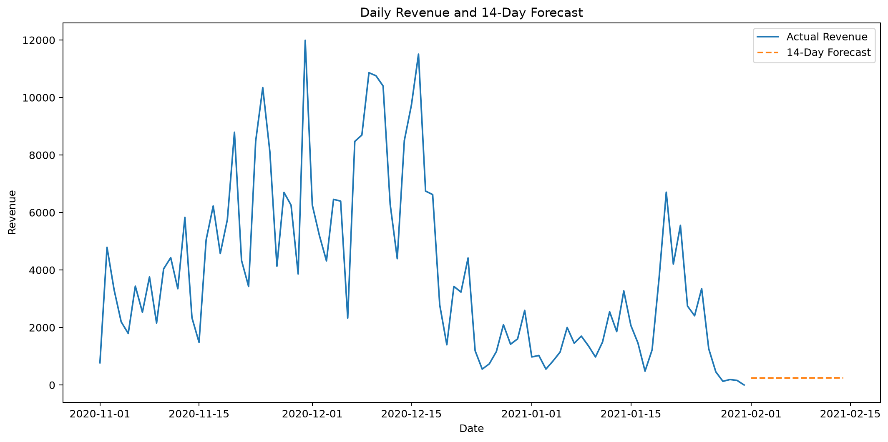

# Customer 360 & Revenue Growth Analytics

## Overview

Customer 360 & Revenue Growth Analytics is an end-to-end business intelligence portfolio project covering customer behaviour, retention, acquisition, product performance, forecasting, experimentation and marketing efficiency.

The solution uses Power BI Project (PBIP), PBIR report source, a TMDL semantic model, Python, SQL, DAX, Visual Studio Code and Git.

## Dashboard Pages

- Executive Overview
- Customer & Retention
- Acquisition & Product Performance
- Forecasting & Experimentation
- Marketing Performance

## Marketing Performance

The Marketing Performance section uses synthetic campaign data for portfolio demonstration.

- Total marketing spend: GBP 40,000
- Attributed revenue: GBP 166,000
- Marketing profit: GBP 126,000
- Acquisitions: 2,430
- Overall ROAS: 4.15x
- Blended CPA: GBP 16.46
- Marketing ROI: 315.0%

### Campaign Insights

- Email Retargeting has the strongest ROAS.
- Google Search generates the highest absolute attributed revenue.
- Affiliate demonstrates strong efficiency.
- Display Prospecting has the weakest ROAS and highest CPA.

## Dashboard Design

The dashboard uses a colourful professional design system.

- Executive views: blue
- Customer and retention: purple
- Revenue: green
- Marketing: orange
- Product: pink
- Channel: cyan

## Technology Stack

- Microsoft Power BI
- DAX
- Power Query
- PBIP
- PBIR
- TMDL
- Python
- SQL
- Visual Studio Code
- Git
- GitHub

## Quality Assurance

Automated checks validate:

- PBIP structure
- PBIR JSON
- semantic-model presence
- page preservation
- report documentation
- Git status
- GitHub publication

QA output is stored under:

`reports/qa/`

<!-- DASHBOARD_GALLERY_START -->

## Power BI Dashboard

Below is the final Power BI dashboard from the Customer 360 & Revenue Growth Analytics project.

<!-- DASHBOARD_GALLERY_END -->

## Author

Oluwatosin Oluwaseun Mulero

Data Analyst | Data Scientist
