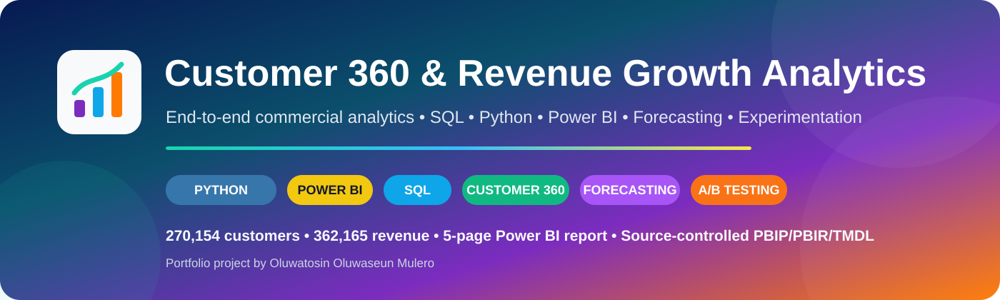
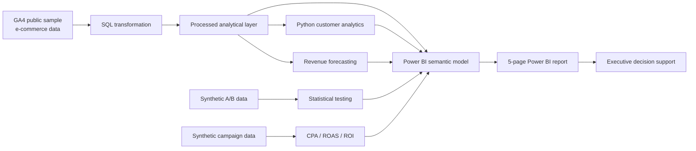

<p align="center">
  
</p>

<p align="center">
  <a href="https://github.com/tosinmulero/customer-360-revenue-growth-analytics/actions/workflows/portfolio-quality.yml">
    
  </a>
  
  
  
  
  
  
</p>

<p align="center">
  <b>SQL · Python · Power BI · DAX · Power Query · PBIP · PBIR · TMDL · Forecasting · Experimentation</b>
</p>

A source-controlled **Customer 360 and revenue-growth analytics solution** that turns e-commerce behavioural data into executive decision support across acquisition, conversion, retention, product performance, forecasting, experimentation and marketing efficiency.

> 🧭 **Data integrity:** Customer, acquisition, product, revenue and forecasting analysis use Google GA4 public sample e-commerce data. A/B experiment observations and campaign-spend data are synthetic, reproducible and explicitly labelled.

---

## 🎯 Executive Snapshot

| Business outcome | Result |
| --- | ---: |
| 👥 Customers analysed | **270,154** |
| 🛒 Purchasing customers | **4,419** |
| 🔁 Repeat purchasers | **775** |
| 💷 Total GA4 revenue | **362,165** |
| 📈 Highest-revenue month | **Dec 2020 - 160,555** |
| 🌐 Highest-revenue channel | **google / organic - 95,775** |
| 🧥 Top product | **Google Zip Hoodie F/C - 13,692** |
| 🔮 Forecast holdout MAE | **1,809.72** |
| 📐 Forecast holdout RMSE | **2,278.03** |
| 🧪 Synthetic A/B lift | **19.25%** |
| 🧮 Synthetic A/B p-value | **0.0186** |

### Why this project stands out

- **Business-first framing** — every analytical layer answers a commercial question.
- **Full analytical stack** — SQL transformation, Python analysis, statistical modelling and Power BI.
- **Source-controlled BI engineering** — PBIP, PBIR and TMDL are versioned in Git.
- **Statistical discipline** — forecast holdout evaluation and hypothesis testing.
- **Transparent provenance** — observed GA4 analysis is separated from synthetic demonstration data.
- **Reproducibility** — deterministic synthetic experiments and automated quality checks.
- **Executive communication** — five purpose-built Power BI report pages.

---

## 🧩 Business Problem

The project creates a unified analytical layer to answer:

1. **Who converts?**
2. **Who purchases again?**
3. **Which channels generate the most revenue?**
4. **Which cohorts and customer segments are most valuable?**
5. **Which products drive performance?**
6. **What does recent revenue history imply for the next 14 days?**
7. **How can experimentation and campaign economics be evaluated rigorously?**

---

## 🏗️ Analytical Architecture



📘 Full design: [`docs/TECHNICAL_ARCHITECTURE.md`](docs/TECHNICAL_ARCHITECTURE.md)

---

# 📊 Power BI Dashboard Gallery

## 🔵 1. Executive Overview


Executive KPIs covering customers, purchasing customers, revenue, purchase rate, repeat purchase rate and revenue per customer.

---

## 🟣 2. Customer & Retention


Customer segmentation, cohort behaviour and retention analysis.

---

## 🟢 3. Acquisition & Product Performance


Acquisition-source performance, device conversion and product revenue.

---

## 🟠 4. Forecasting & Experimentation


Real-data revenue forecasting plus explicitly synthetic experimentation and campaign-performance analysis.

---

## 🟡 5. Marketing Performance


Campaign economics across spend, attributed revenue, CPA, ROAS and acquisition volume using synthetic campaign observations.

---

## 🧠 Customer 360 & RFM Segmentation

The validated customer-level output contains:

- **270,154 customer records**
- **0 duplicate user IDs**
- **0 missing user IDs**
- **4,419 purchasing customers**
- **775 repeat purchasing customers**

RFM analysis structures customers around:

- 🕒 **Recency**
- 🔁 **Frequency**
- 💰 **Monetary value**

This creates a reusable segmentation layer for CRM, retention and commercial analysis.

---

## 🗄️ SQL Analytics Layer

The repository contains **19 SQL analytical transformations** spanning:

| Area | Coverage |
| --- | --- |
| 🧪 Profiling | dataset profile, event types, daily activity |
| 🌐 Acquisition | traffic acquisition, channel performance |
| 👤 Customer | Customer 360 analytical view |
| 🛒 Conversion | funnel and conversion |
| 🔁 Retention | cohort retention |
| 🎯 Segmentation | RFM |
| 📦 Product | product performance |
| 💷 Revenue | revenue summary, monthly and daily revenue |
| 📱 Device | device analysis and conversion |
| 📈 KPIs | monthly commercial KPI layer |

Explore: [`sql/`](sql/)

---

## 🌐 Acquisition & Product Insights

Observed GA4-sample findings include:

- **google / organic** — highest-revenue acquisition channel at **95,775**
- **Google Zip Hoodie F/C** — highest-revenue product at **13,692**
- Channel evaluation combines **conversion + revenue**, not traffic volume alone.
- Device conversion analysis adds another view of funnel performance.

---

## 🔮 Revenue Forecasting

The forecasting workflow uses **Holt's damped-trend method** on real GA4 daily revenue.

| Forecast design | Value |
| --- | ---: |
| Historical observations | **92 days** |
| Holdout period | **14 days** |
| Forecast horizon | **14 days** |
| Holdout MAE | **1,809.72** |
| Holdout RMSE | **2,278.03** |

The model is evaluated against a holdout period before final forecast generation.

---

## 🧪 Synthetic A/B Experiment

A reproducible synthetic experiment is created from the real GA4 conversion baseline.

| Metric | Control | Variant |
| --- | ---: | ---: |
| Users | 20,000 | 20,000 |
| Conversions | 322 | 384 |
| Conversion rate | 1.61% | 1.92% |

- 📈 Relative lift: **19.25%**
- 🧮 P-value: **0.0186**
- ✅ Result: **statistically significant at the 5% level**

Method: **two-proportion z-test**

---

## 📣 Synthetic Marketing Performance

| KPI | Result |
| --- | ---: |
| 💸 Spend | **GBP 40,000** |
| 💰 Attributed revenue | **GBP 166,000** |
| 📊 Marketing profit | **GBP 126,000** |
| 🎯 Acquisitions | **2,430** |
| 🚀 Overall ROAS | **4.15x** |
| 🧾 Blended CPA | **GBP 16.46** |
| 📈 ROI | **315%** |

Campaign-level findings:

- 🥇 **Email Retargeting** — strongest ROAS at **16.00x**
- 💰 **Google Search** — highest attributed revenue at **GBP 52,000**
- ⚡ **Affiliate** — **5.25x ROAS**
- ⚠️ **Display Prospecting** — weakest ROAS and highest CPA

All campaign economics are synthetic.

---

## 🟨 Power BI Engineering

The project uses **Power BI Project format (PBIP)** so report and semantic-model definitions are source-controlled.

```text
powerbi/
├── Customer_360_Revenue_Growth_Dashboard.pbip
├── Customer_360_Revenue_Growth_Dashboard.Report/
└── Customer_360_Revenue_Growth_Dashboard.SemanticModel/
```

Engineering features include PBIP, PBIR, TMDL, DAX, Power Query and Git-versioned report definitions.

---

## 🐍 Python Analytics & Modelling

`notebooks/01_customer_360_python_analysis.py` covers validation, KPIs, RFM, cohorts, acquisition, products, devices and visualisation.

`notebooks/02_advanced_modelling.py` covers forecasting, holdout evaluation, synthetic A/B testing, two-proportion z-testing and synthetic CPA/ROAS analysis.

---

## 🧰 Engineering & Quality Controls

- ✅ customer ID duplicate validation
- ✅ missing customer ID validation
- ✅ real-vs-synthetic provenance disclosure
- ✅ deterministic synthetic experiment seed
- ✅ forecast holdout evaluation
- ✅ source-controlled Power BI definitions
- ✅ Git version control
- ✅ GitHub Actions validation
- ✅ Python syntax checks
- ✅ required dashboard asset checks

---

## 🧱 Technology Stack

<p>
  
  
  
  
  
  
  
  
  
</p>

| Discipline | Technologies |
| --- | --- |
| Data querying | SQL |
| Analysis | Python, pandas, NumPy |
| Statistics | SciPy, statsmodels |
| ML ecosystem | scikit-learn |
| BI | Microsoft Power BI |
| BI modelling | DAX, Power Query |
| Power BI source control | PBIP, PBIR, TMDL |
| Development | Visual Studio Code |
| Version control | Git, GitHub |

---

## 📁 Repository Structure

```text
customer-360-revenue-growth-analytics/
├── .github/workflows/
├── data/
├── docs/
├── images/
├── notebooks/
├── powerbi/
├── reports/
├── sql/
├── customer360_FINAL_BUILD.py
├── requirements.txt
└── README.md
```

---

## ▶️ Reproduce the Analysis

```powershell
python -m venv .venv
.\.venv\Scripts\Activate.ps1
python -m pip install -r requirements.txt
python .\notebooks\01_customer_360_python_analysis.py
python .\notebooks\02_advanced_modelling.py
```

Open:

```text
powerbi/Customer_360_Revenue_Growth_Dashboard.pbip
```

in Power BI Desktop.

---

## ⚖️ Methodology & Limitations

The customer, product, acquisition and revenue analysis uses Google GA4 public sample e-commerce data.

The forecast is a statistical baseline using 92 daily observations and a 14-day holdout period.

A/B observations are synthetic. Campaign spend, impressions, clicks and campaign-performance observations are also synthetic.

**No synthetic result is represented as an observed business outcome.**

---

## 📚 Documentation

- 📘 [`Recruiter Project Summary`](docs/RECRUITER_PROJECT_SUMMARY.md)
- 🏗️ [`Technical Architecture`](docs/TECHNICAL_ARCHITECTURE.md)
- 📣 [`Marketing Performance Methodology`](docs/MARKETING_PERFORMANCE.md)
- 🐍 [`Python Analysis Summary`](reports/python_analysis_summary.txt)
- 🔬 [`Advanced Modelling Summary`](reports/advanced_modelling_summary.txt)

---

## 👨🏾‍💻 Author

**Oluwatosin Oluwaseun Mulero**  
**Data Analyst | Data Scientist**

Built as a portfolio demonstration of **commercial analytics, business intelligence, statistical modelling and source-controlled Power BI engineering**.
