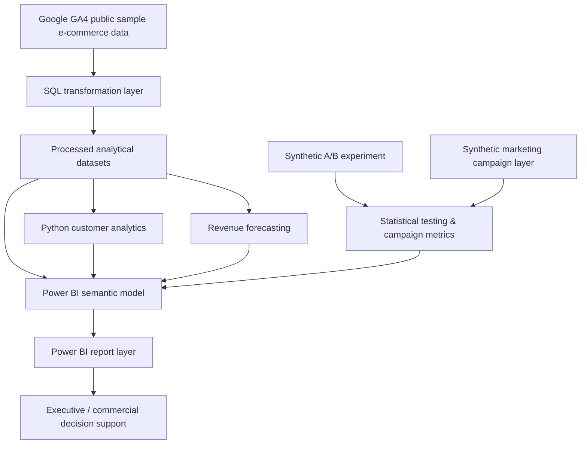

# Technical Architecture

## Overview

Customer 360 & Revenue Growth Analytics is structured as a layered analytical solution rather than a single dashboard file.

The design separates data transformation, analytical modelling, statistical experimentation and presentation so that each layer can be inspected independently.

## Architecture

## Layer 1 - SQL analytical transformation

The `sql/` layer converts analytical source data into reusable business datasets.

Coverage includes:

- dataset profiling
- event analysis
- traffic acquisition
- device analysis
- country analysis
- e-commerce funnel
- revenue summaries
- customer 360
- cohort retention
- RFM segmentation
- product performance
- monthly KPIs
- daily revenue

## Layer 2 - Processed analytical data

`data/processed/` contains structured outputs used across Python and Power BI.

The Customer 360 table acts as the principal customer-level analytical layer.

## Layer 3 - Python analysis

`notebooks/01_customer_360_python_analysis.py` performs validation and exploratory/customer analysis.

Primary controls include duplicate customer-ID checks, missing-ID checks, KPI validation and analytical output generation.

## Layer 4 - Statistical modelling

`notebooks/02_advanced_modelling.py` contains:

- Holt damped-trend revenue forecasting
- holdout MAE/RMSE evaluation
- reproducible synthetic A/B experiment generation
- two-proportion z-testing
- synthetic CPA and ROAS analysis

Synthetic observations use a fixed random seed so that results are reproducible.

## Layer 5 - Power BI semantic model

The Power BI solution is stored using PBIP/PBIR/TMDL source-control-friendly formats.

This makes report and semantic-model definitions inspectable through Git rather than hiding the complete BI implementation inside one binary file.

## Layer 6 - Dashboard presentation

Five report pages provide different decision views:

1. Executive Overview
2. Customer & Retention
3. Acquisition & Product Performance
4. Forecasting & Experimentation
5. Marketing Performance

## Data provenance

### Observed analytical data

The customer, acquisition, product, revenue and forecasting components are derived from Google GA4 public sample e-commerce data.

### Synthetic analytical data

The following are synthetic and exist to demonstrate methodology:

- A/B experiment observations
- campaign spend
- campaign impressions
- campaign clicks
- campaign-attributed revenue
- derived CPA, ROAS and ROI measures

The repository explicitly labels these components to avoid presenting simulated outcomes as observed business performance.

## Engineering principles

The project applies the following engineering principles:

- separation of concerns
- reusable analytical layers
- source control
- reproducibility
- explicit data provenance
- automated structural quality checks
- model evaluation before forecast generation
- transparent analytical limitations
