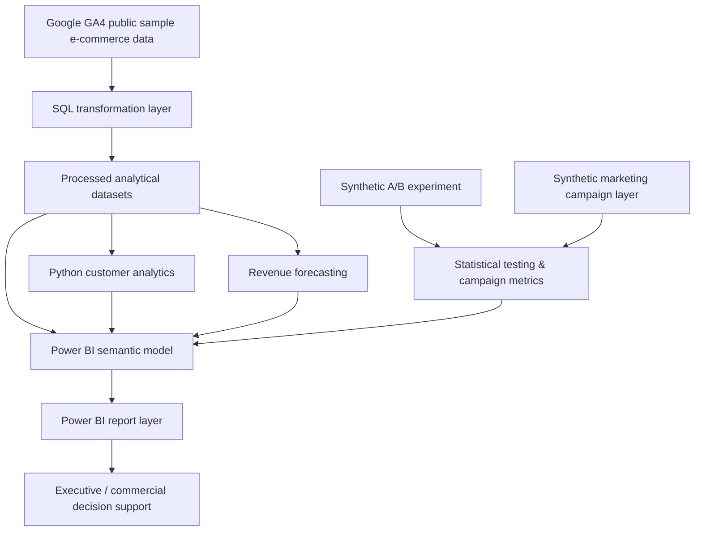

# 🏗️ Technical Architecture

## Overview

Customer 360 & Revenue Growth Analytics is structured as a layered analytical solution rather than a single dashboard file.

The design separates transformation, analysis, statistical modelling and presentation so each layer can be inspected independently.

## Architecture

## 🔵 SQL transformation
Covers customer, acquisition, conversion, retention, RFM, product, device, KPI and revenue analysis.

## 🟢 Processed analytical data
`data/processed/` contains reusable outputs for Python and Power BI.

## 🟣 Python customer analytics
Validation, KPIs, segmentation, cohorts, acquisition, product and device analysis.

## 🟠 Statistical modelling
Holt damped-trend forecasting, holdout evaluation, synthetic A/B testing and campaign-efficiency analysis.

## 🟡 Power BI semantic model
PBIP/PBIR/TMDL source-controlled definitions keep the BI implementation inspectable in Git.

## 🧭 Data provenance

Observed analytical data derive from Google GA4 public sample e-commerce data.

Synthetic components are limited to A/B experiment observations and campaign economics. They are explicitly labelled throughout the project.

## Engineering principles

- separation of concerns
- reusable analytical layers
- source control
- reproducibility
- explicit data provenance
- automated quality checks
- transparent limitations
